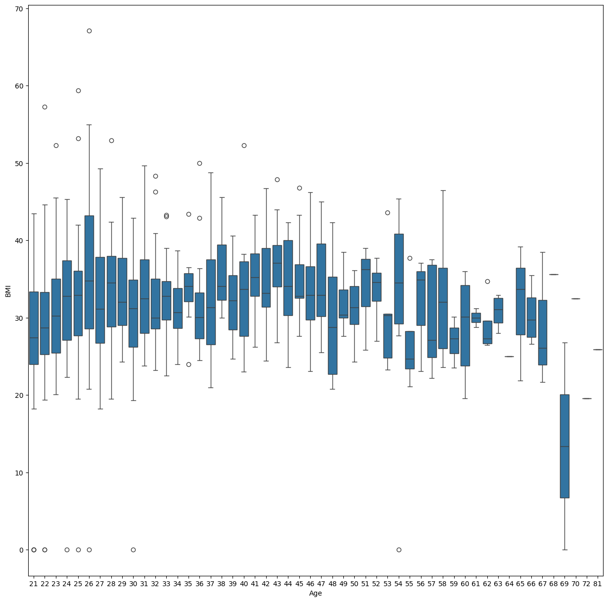
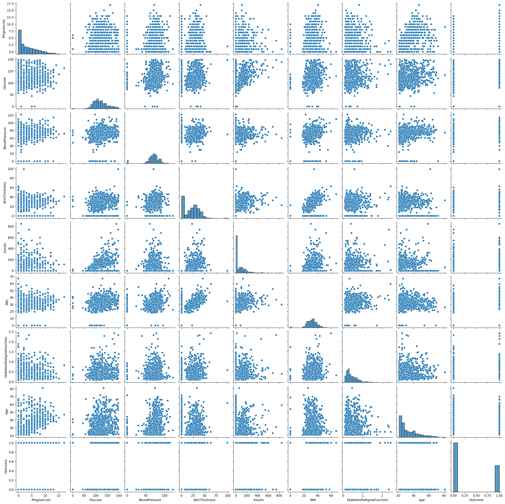
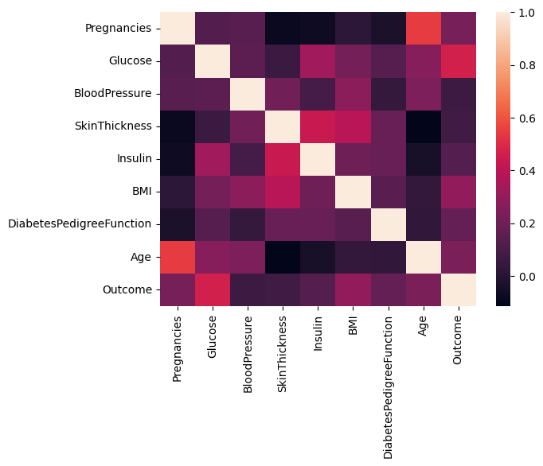
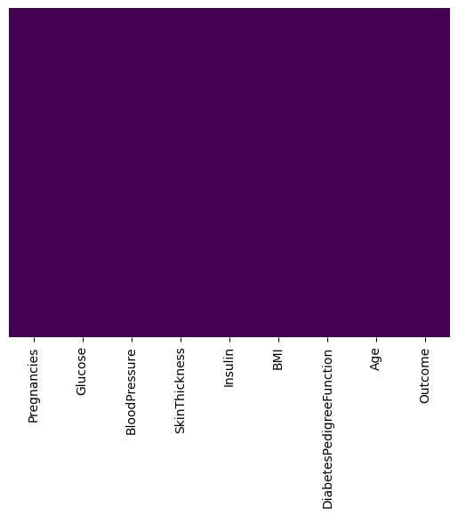
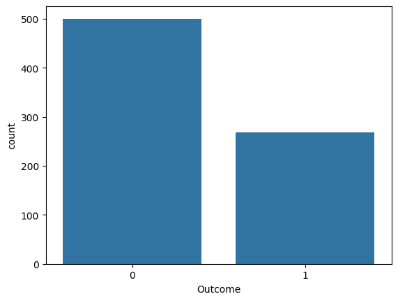
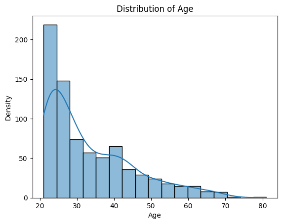
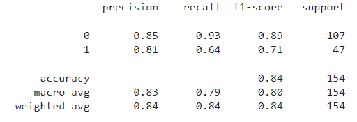
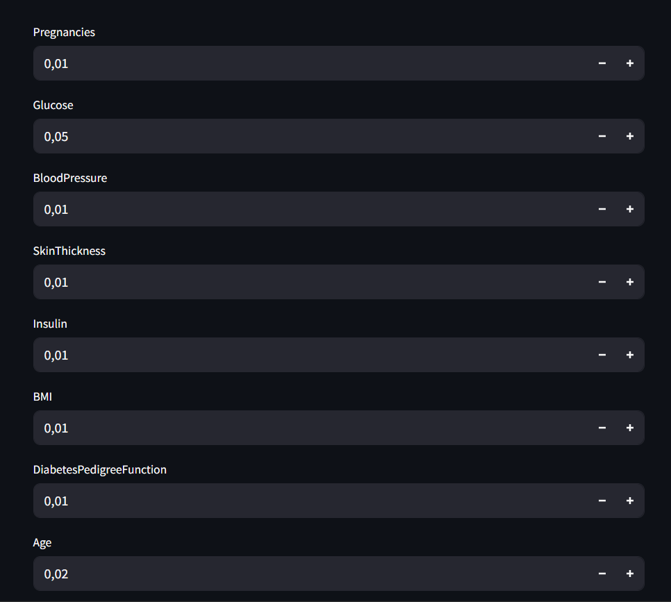

# Laporan Proyek Machine Learning
### Nama : Arry Nurdiansyah
### Nim : 211351027
### Kelas : Pagi C

## Domain Proyek

Diabetes menjadi salah satu penyakit yang mematikan di dunia, termasuk di Indonesia. Diabetes dapat menyebabkan komplikasi di banyak bagian tubuh dan secara keseluruhan dapat meningkatkan risiko kematian. Salah satu cara untuk mendeteksi penyakit diabetes adalah dengan memanfaatkan algoritma machine learning. Logistic regression merupakan model klasifikasi dalam machine learning yang banyak digunakan dalam analisis klinis 

## Business Understanding

### Problem Statements

- Ketidakmungkinan bagi seseorang untuk memprediksi diabetes. 

### Goals

- mencari solusi untuk menganalisis penyakit diabetes yang diderita.

### Solution statements
- Pengembangan Platform Diabetes Prediction with Logistic Regression Berbasis Web, Solusi pertama adalah mengembangkan platform pengechekan diabetes yang mengintegrasikan data dari Kaggle.com untuk memberikan pengguna akses mudah untuk menganalisis diabetes yang diderita. 
- Model yang dihasilkan dari datasets itu menggunakan metode Linear Regression.

## Data Understanding
Dataset yang saya gunakan berasal dari Kaggle.<br> 

[Diabetes Prediction with Logistic Regression](https://www.kaggle.com/datasets/kandij/diabetes-dataset).

### Variabel-variabel pada Diabetes Prediction with Logistic adalah sebagai berikut:

-Pregnancies : mempresentasikan berapa kali wanita tersebut hamil selama hidupnya.

-Glucose : mempresentasikan konsentrasi glukosa plasma pada 2 jam dalam tes toleransi glukosa.

-BloodPressure : Tekanan darah adalah cara yang sangat terkenal untuk mengukur kesehatan jantung seseorang, ada juga ukuran tekanan darah yaitu diastolik dan sistolik. Dalam data ini, kita memiliki tekanan darah diastolik dalam (mm / Hg) ketika jantung rileks setelah kontraksi.

-SkinThickness : nilai yang digunakan untuk memperkirakan lemak tubuh (mm) yang diukur pada lengan kanan setengah antara proses olecranon dari siku dan proses akromial skapula.

-Insulin : tingkat insulin 2 jam insulin serum dalam satuan mu U/ml.

-BMI : Indeks Massa Tubuh berat dalam kg / tinggi dalam meter kuadrat, dan merupakan indikator kesehatan seseorang.

-DiabetesPedigreeFunction : Indikator riwayat diabetes dalam keluarga

-Age : umur.

## Data Preparation
### Data Collection
Untuk data collection ini, saya mendapatkan dataset yang nantinya digunakan dari website kaggle dengan nama dataset Diabetes Prediction with Logistic Regression, jika anda tertarik dengan datasetnya, anda bisa click link diatas.

### Data Discovery And Profiling
Untuk bagian ini, kita akan menggunakan teknik EDA. <br>
Pertama kita mengimport semua library yang dibutuhkan,

```bash
from google.colab import files
files.upload()
```

```bash
!mkdir -p ~/.kaggle
!cp kaggle.json ~/.kaggle/
!chmod 600 ~/.kaggle/kaggle.json
!ls ~/.kaggle
```

```bash
!kaggle datasets download -d kandij/diabetes-dataset
```
```bash
!mkdir diabetes-dataset
!unzip diabetes-dataset.zip -d diabetes-dataset
!ls diabetes-dataset
```

```bash
import numpy as np
import pandas as pd
import seaborn as sns
import matplotlib.pyplot as plt
from sklearn.model_selection import train_test_split
from sklearn.linear_model import LinearRegression

import os
for dirname, _, filenames in os.walk('/kaggle/input'):
    for filename in filenames:
        print(os.path.join(dirname, filename))
```

lanjut dengan memasukkan file csv yang telah diextract pada sebuah variable, dan melihat data paling atas dari datasetsnya
```bash
df = pd.read_csv('/content/diabetes-dataset/diabetes2.csv')
```

```bash
df.head()
```

```bash
df.info()
```

```bash
df.describe()
```

```bash
sns.heatmap(df.isnull(),yticklabels=False,cbar=False,cmap='viridis')
```


```bash
sns.countplot(x='Outcome',data=df)
```


```bash
sns.histplot(df['Age'].dropna(), kde=True)
plt.xlabel('Age')
plt.ylabel('Density')
plt.title('Distribution of Age')
plt.show()
```


```bash
df.corr()
```

```bash
sns.heatmap(df.corr())
```


```bash
sns.pairplot(df)
```


```bash
plt.subplots(figsize=(15,15))
sns.boxplot(x='Age', y='BMI', data=df)
```


```bash
x = df.drop('Outcome',axis=1)
y = df['Outcome']
```

```bash
from sklearn.model_selection import train_test_split
x_train,x_test,y_train,y_test = train_test_split(x,y,test_size=0.3,random_state=101)
```

## Modeling

```bash
from sklearn.linear_model import LogisticRegression
logmodel = LogisticRegression()
logmodel.fit(x_train,y_train)
```

```bash
predictions = logmodel.predict(x_test)
```

```bash
from sklearn.metrics import confusion_matrix
```

```bash
confusion_matrix(y_test,predictions)
```

```bash
df.head()
```

```bash
print(x)
```

```bash
x = pd.DataFrame(df, columns = ['Pregnancies','Glucose','BloodPressure','SkinThickness','Insulin','BMI','DiabetesPedigreeFunction','Age'])
y = df['Outcome'].values.reshape(-1,1)
```

```bash
x_train, x_test, y_train,y_test = train_test_split(x,y , test_size = 0.2 , random_state = 0)
```

```bash
lr = LinearRegression()
lr.fit(x_train,y_train)
```

#EVALUATION
Berdasarkan metrik evaluasi, proyek ini memberikan hasil yang positif. Model Regresi Linear yang telah dikembangkan mampu memprediksi Diabetes dengan akurasi yang baik. score yang tinggi mengindikasikan bahwa model mampu menjelaskan sebagian besar variabilitas dalam memprediksi diabetes.

```bash
from sklearn.metrics import classification_report
predictions = logmodel.predict(x_test)
print(classification_report(y_test,predictions))
```


## Deployment

[My Estimation App](https://appediabetes-ggg7suearpfjpeadzmucuf.streamlit.app/).


